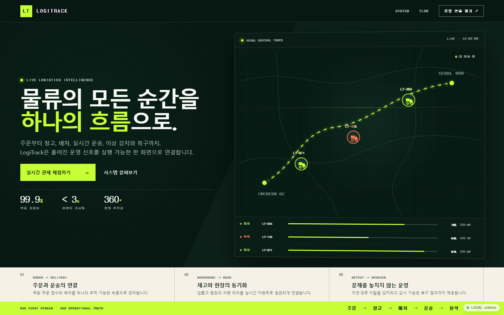
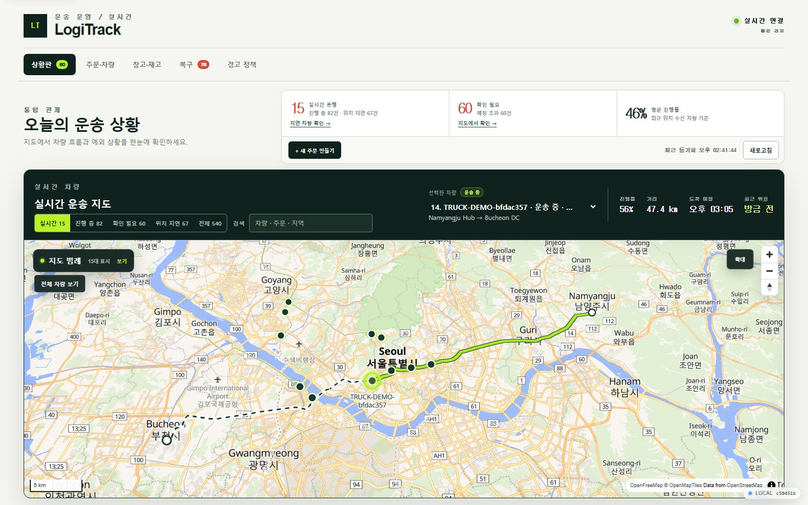
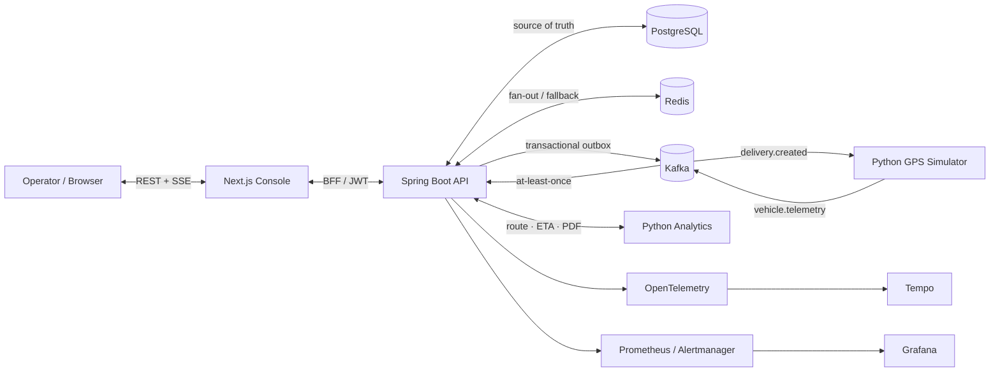

# LogiTrack

[](https://github.com/automaster5013/LogiTrack/actions/workflows/ci.yml)
[](LICENSE)
[](https://www.bestpractices.dev/projects/14964)
[](https://www.logitrack.kr)

> 주문 접수부터 창고, 배차, 실시간 GPS 관제, 이상 감지와 장애 복구까지 하나의 흐름으로 재현하는 이벤트 기반 물류 Control Tower입니다.

**[라이브 쇼케이스](https://www.logitrack.kr)** · **[10분 데모 시나리오](docs/demo.md)** · **[아키텍처 상세](docs/architecture.md)** · **[운영 설계](docs/operations.md)**

LogiTrack is a production-minded logistics control tower built with Spring Boot, Kafka, Python, Next.js, and PostgreSQL. It runs a complete, observable delivery workflow without dedicated GPS hardware.

## 30초 요약

| 보여주는 역량 | 구현 내용 |
| --- | --- |
| 제품 흐름 | 주문 → 배차 → 경로/ETA → GPS 이동 → 경고 → 배송 완료 |
| 분산 시스템 신뢰성 | Transactional outbox, at-least-once Kafka, 멱등 consumer, DLQ replay와 감사 |
| 실시간 운영 UX | MapLibre 지도, 계획/실제 경로, SSE 갱신, 검색·필터·고밀도 반응형 화면 |
| 운영 가능성 | OpenTelemetry trace, Prometheus 경보, Grafana, 백업/복원과 장애 복구 runbook |
| 전달 품질 | 자동 테스트, 80% coverage gate, SBOM, 취약점 검사, immutable image와 AWS staging |

이 프로젝트의 핵심은 화면 수가 아니라 **실패해도 유실·중복·무한 재시도 없이 복구할 수 있는 업무 흐름**입니다. 생성 명령과 이벤트를 같은 PostgreSQL 트랜잭션에 기록하고, 재전달은 event ID와 요청 키로 흡수하며, 사람이 개입해야 하는 실패는 운영자·승인·감사를 남기는 복구 절차로 전환합니다.

## 화면 미리보기



*프로젝트 쇼케이스 — 문제, 시스템 경계와 핵심 운영 흐름을 한 화면에 설명합니다.*



*운영 상황판 — 자동 보충되는 15대 차량, 상태 command center, 계획·실제 경로와 접근 가능한 확대 지도를 표시합니다.*

## 데모 접근

| 목적 | 경로 | 안내 |
| --- | --- | --- |
| 프로젝트 빠르게 보기 | [공개 쇼케이스](https://www.logitrack.kr/showcase) | 로그인 없이 가치, 시스템 구성과 처리 흐름 확인 |
| 인증 UX 확인 | [운영자 로그인](https://www.logitrack.kr/login) | Passkey/WebAuthn과 교차 기기 QR 로그인 화면 |
| 전체 기능 직접 체험 | [로컬 실행](#5분-로컬-실행) | 인증 없이 주문·창고·관제·복구 기능 사용 |
| 발표 순서 따라가기 | [10분 데모 시나리오](docs/demo.md) | 기능과 기술적 의도를 함께 설명하는 walkthrough |

공개 AWS 환경의 운영 콘솔은 실제 운영 경계와 동일하게 인증으로 보호됩니다. 평가자가 모든 command를 직접 실행하려면 로컬 데모를 사용하면 됩니다. 공개 환경은 비용 최적화된 단일 호스트 **staging**이며 production 가용성을 주장하지 않습니다.

## 대표 시나리오

1. 주문을 만들고 차량을 배차하면 주문·배송 aggregate와 outbox event가 한 트랜잭션으로 저장됩니다.
2. Python analytics가 도로 경로와 ETA snapshot을 만들고 simulator가 결정론적 GPS event를 Kafka로 발행합니다.
3. Spring Boot consumer가 위치·진행률을 멱등 반영하고 Redis Pub/Sub과 SSE로 모든 API 인스턴스와 브라우저에 전달합니다.
4. 지연이나 경로 이탈은 hysteresis 기반 경고가 되어 운영자가 확인하고, 모든 변경은 감사 이력으로 남습니다.
5. 영구 오류는 DLQ catalog로 격리됩니다. 운영자는 dry-run과 명시적 승인 후 replay 또는 discard하며 중복 실행은 차단됩니다.

창고 시나리오에서는 입고 → 피킹 → 출고를 수행하면서 가용·예약 재고와 불변 원장을 확인할 수 있습니다. KPI 화면은 일별 cohort, 정시율과 cycle time을 제공하고 CSV/PDF로 내보냅니다.

## 아키텍처



### 실패 경계를 설계한 방식

| 위험 | 방어 |
| --- | --- |
| DB commit 후 event 유실 | 동일 transaction의 outbox와 bounded publisher retry |
| Kafka 재전달 | `processed_events`와 결정론적 event ID |
| 동일 command 재시도 | payload에 결속된 `Idempotency-Key`와 advisory/pessimistic lock |
| poison event 재시작 loop | 계약 검증 후 DLQ 격리, source 위치 기반 catalog 중복 방지 |
| Redis·route provider 장애 | local SSE 및 deterministic geodesic fallback |
| 운영자 중복 조치 | dry-run plan, 만료 승인, 단방향 상태 전이와 불변 감사 |
| 잘못된 배포 | commit SHA/digest 고정 image, provenance 검증과 자동 rollback |

서비스 경계, event envelope, 데이터 모델과 확장 전략은 [아키텍처 문서](docs/architecture.md)에 정리되어 있습니다.

## 기술 스택

| 영역 | 기술 |
| --- | --- |
| Web | Next.js, TypeScript, MapLibre, Playwright |
| API | Java 21, Spring Boot, JPA, Flyway |
| Data & messaging | PostgreSQL, Redis, Apache Kafka |
| Analytics | Python, FastAPI, OSRM-compatible routing, ReportLab |
| Observability | OpenTelemetry, Tempo, Prometheus, Alertmanager, Grafana |
| Delivery | Docker Compose, GitHub Actions, Terraform, AWS, Docker Hub |

## 5분 로컬 실행

요구 사항은 Docker Desktop과 Docker Compose v2입니다.

```powershell
pwsh ./scripts/init-env.ps1
docker compose up -d --build --wait
```

`init-env.ps1`는 Git에서 제외된 `.env`에 PostgreSQL과 Grafana용 독립 난수 비밀번호를 만들며 기존 파일은 덮어쓰지 않습니다.

- 쇼케이스: http://localhost:3000/
- 운영 콘솔: http://localhost:3000/console
- API readiness: http://localhost:8080/actuator/health/readiness
- Grafana: http://localhost:3001 (`admin` / `.env`의 `GRAFANA_ADMIN_PASSWORD`)
- Prometheus: http://localhost:9090
- Alertmanager: http://localhost:9093

스택은 15대의 움직이는 데모 차량을 자동 유지합니다. 새 배송은 콘솔의 `+ SIMULATE DELIVERY`로 만들 수 있으며, 종료해도 named volume의 업무 데이터와 관측 이력은 유지됩니다.

```powershell
docker compose down
```

전체 설치·백업·자격 증명·포트 설명은 [English quick start](docs/quickstart.en.md)와 [운영 가이드](docs/operations.md)를 참고하세요.

## 저장소 구조

```text
api/          Spring Boot command/query, event consumer, recovery API
web/          Next.js showcase와 운영 콘솔
simulator/    Kafka 기반 GPS·배송 상태 생성기
analytics/    경로·ETA 분석과 KPI PDF renderer
infra/        관측성 및 AWS/Terraform 구성
scripts/      재현 가능한 계약·통합·장애·부하 smoke
docs/         아키텍처, ADR, 운영 및 전환 문서
```

## 범위와 정직한 한계

- 공개 환경은 포트폴리오 검증용 staging입니다. production용 다중 AZ 데이터·컴퓨트·edge Terraform과 안전한 cutover gate는 구현했지만 비용과 승인 없이 적용하지 않습니다.
- 기본 공개 지도와 route provider는 개발·시연용입니다. 실제 상용 트래픽에는 계약된 SLA 공급자 또는 자체 호스팅이 필요합니다.
- synthetic 배송과 GPS를 사용하므로 실제 운송사·ERP·WMS 계약 연동은 프로젝트 범위 밖입니다.

이 구분을 통해 “작동하는 데모”와 “실제 production 전환에 필요한 책임”을 섞지 않습니다.

## 문서

- [아키텍처와 데이터 모델](docs/architecture.md)
- [운영 및 장애 처리](docs/operations.md)
- [장애 주입 및 복구 runbook](docs/failure-recovery-runbook.md)
- [성능 기준선](docs/performance.md)
- [9주 실행 로드맵](docs/roadmap.md)
- [테스트 품질 기준선](docs/quality.md)
- [CI/CD와 릴리스 전략](docs/delivery.md)
- [10분 데모 시나리오](docs/demo.md)
- [구현 진행 현황](docs/progress.md)
- [프로덕션 cutover gate](docs/production-cutover.md)
- [Transactional outbox 기술 선택](docs/adr/0001-technology-stack.md)
- [DLQ replay와 감사](docs/adr/0007-dlq-replay.md)
- [주문·배송 aggregate 경계](docs/adr/0010-order-delivery-boundary.md)
- [기여 가이드](CONTRIBUTING.md)
- [행동강령](CODE_OF_CONDUCT.md)

## 라이선스

이 프로젝트는 [Apache License 2.0](LICENSE)에 따라 배포됩니다.

## 로컬 검증

```bash
python -m unittest discover simulator/tests
python -m unittest discover analytics/tests
python scripts/compose-config-smoke.py
python scripts/markdown-link-smoke.py
pwsh ./scripts/domain-coverage.ps1
Push-Location web; npm ci; npx playwright install chromium; npm run build; npm run test:e2e; Pop-Location
```

일상적인 변경은 위 검증으로 재현할 수 있습니다. 서비스 경계를 가로지르는 변경은 실행 중인 전체 스택에서 `pwsh ./scripts/smoke.ps1`도 수행합니다.

- Java API: 80% line/branch domain coverage gate
- Python: analytics와 simulator 단위·경계 테스트
- Web: locked production build와 Chromium E2E
- Runtime: 주문, 창고, 경로, 경고, SSE, tracing, KPI, DLQ, 백업/복원 smoke
- Supply chain: production image 5종 SBOM, CRITICAL 취약점 0건, non-root/read-only runtime
- Delivery: PR CI → immutable staging image → 승인 배포 → 독립 외부 health/revision 검사
